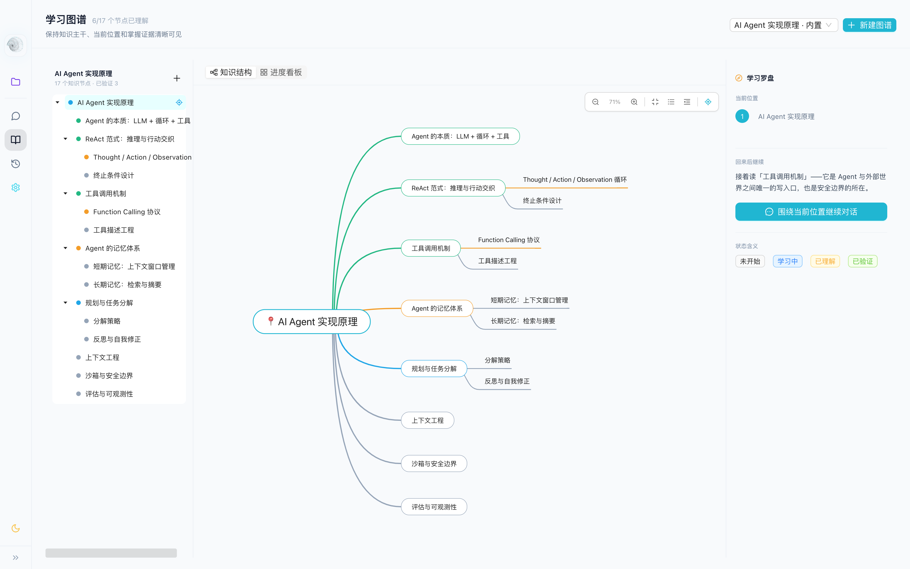
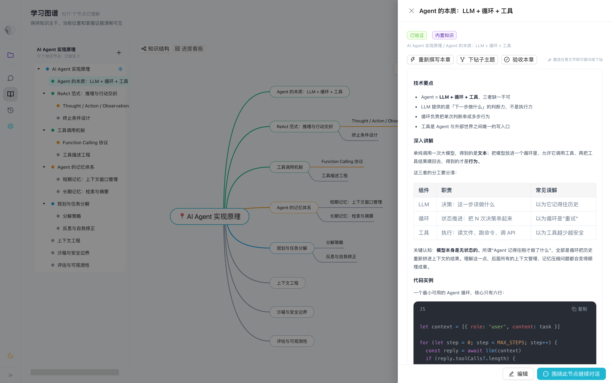
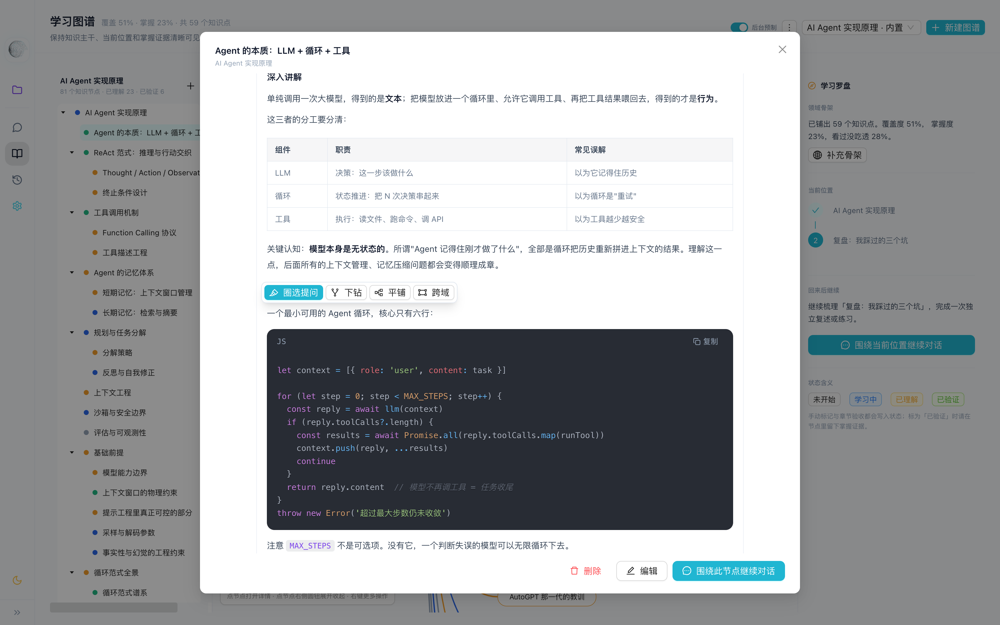

<div align="center">

# Folio 📖

**The book that writes itself as you learn.**

一个本地优先的 AI 学习终端：把知识图谱读成一本活的书 —— 章节由 AI 按需撰写，圈选任意段落当场提问，下钻即长出新章节。

[](LICENSE)
[](https://github.com/lin306808700-ux/folio/actions/workflows/ci.yml)
[](https://www.electronjs.org/)
[](https://nodejs.org/)

</div>

---

## What is Folio?

Most learning dies in scattered notes. Folio gives it a spine.

Build a knowledge graph for any domain — Java backend, frontend, distributed systems — and Folio writes it into a book, one chapter at a time: **crisp key points, real explanations of the *why*, runnable code examples**. No vague summaries.

It reads like paper but acts like an agent: select any passage and ask, the way you'd circle a paragraph and ask a mentor. Drill down on any concept and Folio grows new chapters beneath it. Your questions stay in the margins — the book remembers where you struggled.

Chapters are pre-written in the background, so the page is ready when you are.


<!-- 截图占位：学习图谱 · 知识结构视图（见 docs/screenshots/README.md） -->

## Features

### 📖 活的书 · Living Book
每个知识节点就是一章。AI 按固定结构撰写正文：**技术要点 → 深入讲解 → 代码实例 → 常见误区与考点**，800–1500 字，拒绝笼统介绍。写完即持久化，下次打开直接读。


<!-- 截图占位：节点抽屉 · 章节正文（含代码高亮） -->

### ✂️ 圈选提问 · Select & Ask
书上任何看不懂的地方，圈选即问。答案流式返回，并沉淀进该章节的 Q&A 区 —— 你的困惑成为书的一部分。


<!-- 截图占位：圈选浮动工具条 + AI 回答 -->

### 🌱 下钻衍生 · Drill Down
圈选后可让 AI 衍生出子知识点，自动在当前节点下长出新章节，书的边界随你的好奇心扩展。

### ⚡ 后台预生成 · Background Prefetch
打开应用后，AI 在后台按「当前位置 → BFS 子树 → 其余」逐章预制内容，交互请求（聊天 / 提问 / 手动撰写）随时抢占，零排队。顶栏实时显示预制进度。

### 🗺️ 知识图谱 · Knowledge Graph
- 思维导图与树形大纲双视图，节点四态：未开始 / 学习中 / 已理解 / 已验证
- 进度看板：主干路径、当前位置、掌握分布一目了然
- 内置前端 / Java 服务端两套图谱开箱即用，支持自建


<!-- 截图占位：进度看板视图 -->

### 🤖 AI Terminal
内置 AI 对话与 ReAct 工具执行引擎，命令安全策略 + 沙箱隔离；支持 MCP Server 与插件体系。


<!-- 截图占位：AI 对话页（可选） -->

## Quick Start

### Prerequisites

- Node.js ≥ 18
- 一个可用的模型通道（二选一）：
  - **qoder**（默认）：本机已安装并登录 `qodercli`，零密钥
  - **openai**：任意 OpenAI 兼容 API（OpenAI / DeepSeek / Ollama / vLLM…）

### Install & Run

```bash
git clone https://github.com/lin306808700-ux/folio.git
cd folio
npm install

# 配置模型通道（默认 qoder 可不配置）
cp .env.example .env

# 开发模式（前端热重载）
npm run dev

# 或直接启动
npm start
```

### OpenAI 兼容 API 示例（`.env`）

```bash
MUSE_MODEL_PROVIDER=openai
MUSE_API_BASE_URL=https://api.deepseek.com/v1
MUSE_API_KEY=your-deepseek-key
MUSE_MODEL=deepseek-coder
```

### Build

```bash
npm run build        # electron-builder 打包 dmg / exe / AppImage
npm test             # 核心单测 + 渲染层单测
npm run check        # 语法检查 + 测试 + 前端构建
```

## Architecture

```
folio/
├── src/main/                 # Electron 主进程
│   ├── muse/                 # 学习图谱存储 / AI 提示词 / 后台预生成管线
│   │   ├── learning-maps.js      # 图谱持久化（JSON store，原子写）
│   │   ├── learning-prompts.js   # 撰写 / 提问 / 下钻三类提示词
│   │   └── learning-prefetch.js  # 后台预生成队列 + 交互抢占调度
│   ├── ipc/                  # IPC 流式通道（requestId + AbortController）
│   ├── sandbox/              # 命令安全策略与沙箱执行
│   └── task-engine/          # ReAct 任务引擎
├── src/renderer/             # React + Ant Design 渲染层
│   └── src/
│       ├── pages/LearningMapPage.tsx        # 图谱 / 看板 / 抽屉
│       └── components/LearningBookReader.tsx # 阅读器 + 圈选交互
├── src/shared/model-provider.js  # 模型适配层（qoder / openai，调用标签注册表）
├── src/mcp-server/           # MCP Server
└── plugins/                  # 插件示例
```

**关键机制**

| 机制 | 说明 |
| --- | --- |
| AI 按需撰写 | 章节正文不落死数据，AI 生成后持久化到节点 `content` |
| 调用标签注册表 | 每次 AI 调用带 label；`isAiBusy()` 让路检测、`abortCallsByLabel()` 交互抢占 |
| 预生成队列 | 当前位置优先的 BFS 排序，被抢占章节留队重试，不丢进度 |
| 流式 IPC | requestId 关联请求与推送，渲染端随时可中断 |

更多细节见 [docs/architecture.md](docs/architecture.md) 与 [docs/codebase-map.md](docs/codebase-map.md)。

## Roadmap

见 [ROADMAP.md](ROADMAP.md)。欢迎在 Issues 提出你想让 Folio 写的第一本书。

## Contributing

阅读 [CONTRIBUTING.md](CONTRIBUTING.md) 与 [AGENTS.md](AGENTS.md) 了解协作约定。提交前请跑 `npm run check`。

## License

[Apache License 2.0](LICENSE) · Copyright 2026 changyuan.lcy
